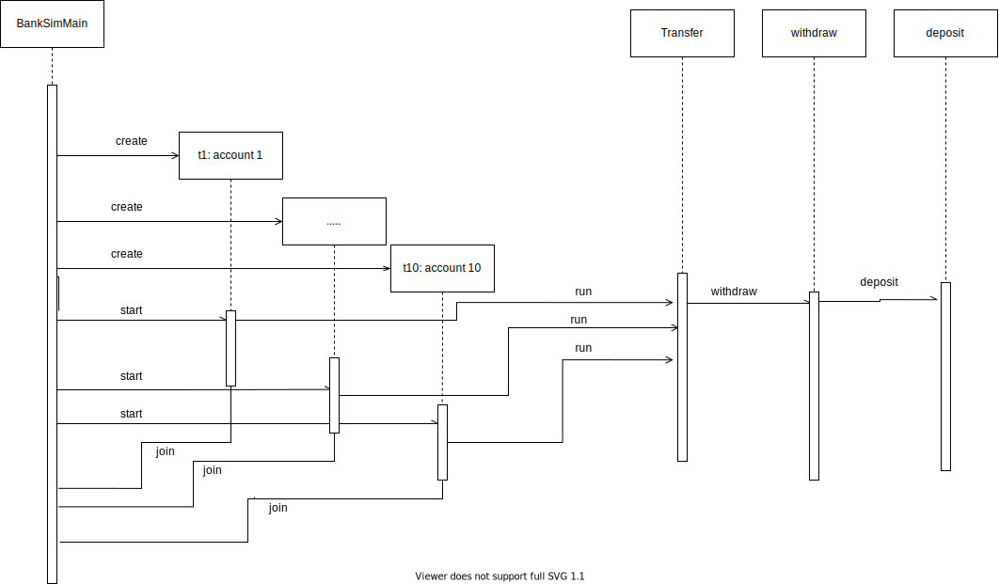

# BankSim
# Race Condition

When main runs 10 threads, Each account thread will execute Transfer method.
When a thread doing withdraw and deposit, other account threads sneak another transfer method that cause overwrite the balance.
The order is undetermined and will change the total balance above or below the expected balance.