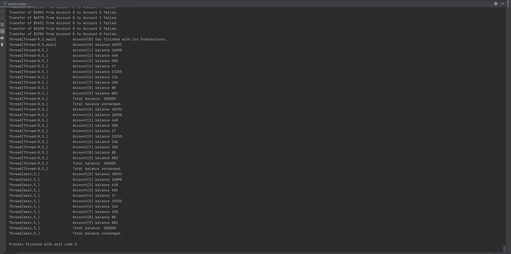
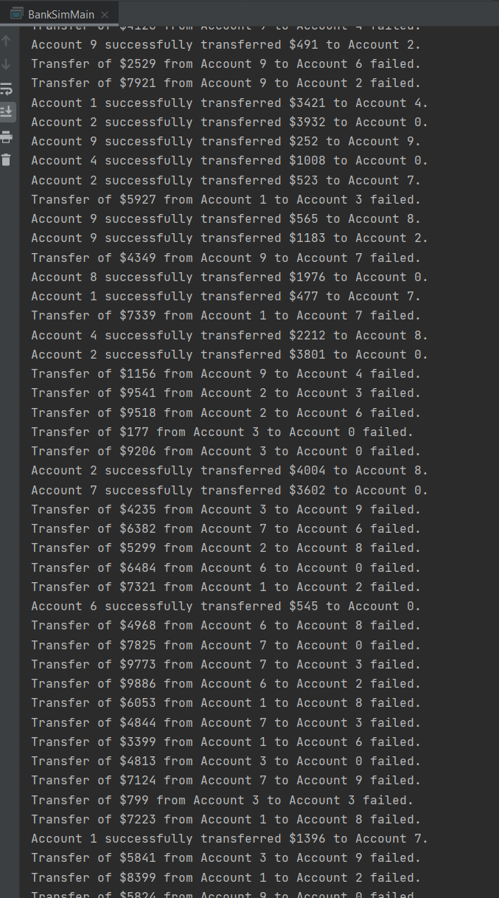
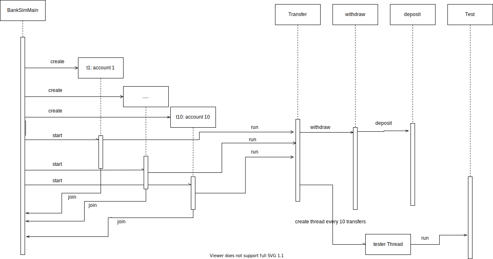

# BankSim

## Requirements
The purpose of this project is to modify a multi-threaded banking simulator by eliminating race conditions and deadlock. The program had to be capable of processing multiple transactions at ONCE, while waiting for invalid transactions to become possible and successfully implementing concurrency.
We started by using a UML sequence diagram to identify the cause of the race condition, then fixed the race condition accordingly. Afterwards, we refactored the testing method into its own thread and provided protection against testing/transfer threads running simulaneuosly. This required wait/signal solutions to implement proper concurrent functionality in the testing and transfer threads, as well as the Bank and Account classes. Finally, we made the bank close once a transfer thread finishes all of its trading for the day, and protected against deadlock caused by testing threads and transactions postponed due to inadequate funds.

## Teamwork
### Tandi:
+ Create UML sequence diagram to explain race condition in the program
+ Update the sequence diagram with task 3
+ Provide code protection (testing thread and transfer threads are running exclusively)
+ Implement a wait/signal solution for the testing thread and transfer threads
+ README.md

### Eddie:
+ Protect against race condition --> test transfers for correctness
+ Refactor the method of testing into a new separate thread
+ Implement a wait/notify solution to allow an account to transfer out funds if the transferring amount is greater than the account balance
+ Implement a solution in which all threads stop transferring (the bank is closed) whenever one thread completes its transfers
+ Updated README.md

## Testing code
We used system testing, in which we tested the program after each task and made sure the program works correctly. The test was done by the same person who finished the task, often by sleeping transfer threads during testing in order to get a clear impression of current output, then reviewed by the other programmer after they are committed. We made sure to test everything before merge to master branch.

 
We made sure the program run for around 10000 times for each thread, and the total balance should be unchanged.

 
We verified that the program is actually making transfers in multi-threads, and some of them should have failed.

## Race Condition

 
Main runs 10 transfer threads concurrently, with care taken to avoid a specific account from being deposit to/withdrawn by two threads at once.
Transactions are randomly generated by the provided testing program.

## Tester Thread

 
Each transfer thread will create a new test thread every 10 transfers, and the bank will run a test at the end of the trading day. Since only intra-bank transactions are allowed, the balance is expected to remain unchanged. The tester thread runs while the transfer threads are frozen in order to take a snapshot of a single point during the trading day.

# Project Board
Link: https://trello.com/b/3nYKS152/wells-fargo-equifax
https://trello.com/b/3nYKS152 
